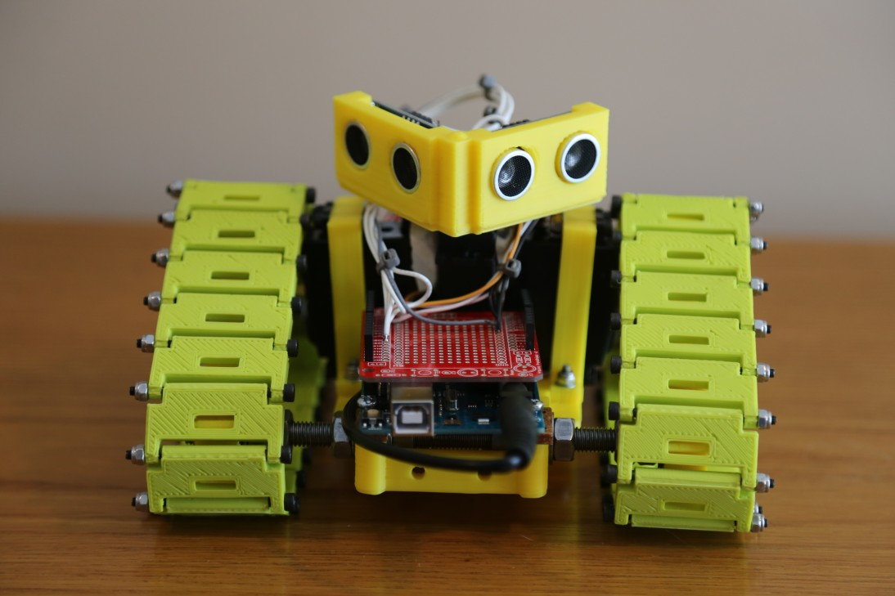
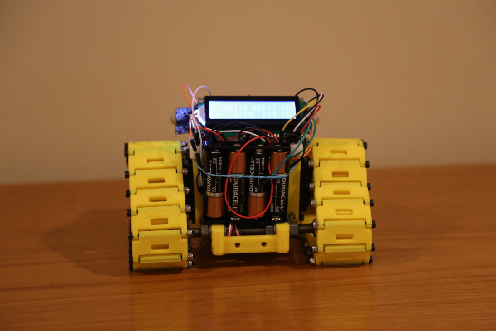

# arduino-tank

A 3D printed tank that uses an Arduino to do basic obstacle avoidance.

## Required 3D model files

Note: All of these 3D models were downloaded from https://www.thingiverse.com/thing:19170. Print the following components:

Qty | Description                                                            | Original source
----|------------------------------------------------------------------------|-----------------------------------------
  2 | [Tri-Track frame end segments](3d-models/tri-track_frame_end.stl)      | https://www.thingiverse.com/thing:19170
  1 | [Tri-Track frame middle segment](3d-models/tri-track_frame_middle.stl) | https://www.thingiverse.com/thing:19170
 42 | [Track sections](3d-models/track_plate_8.stl)                          | https://www.thingiverse.com/thing:8559 
  2 | [Drive sprockets](3d-models/drive_sprocket.stl)                        | https://www.thingiverse.com/thing:14599
  4 | [608 idler sprockets](3d-models/608_idler_sprocket.stl)                | https://www.thingiverse.com/thing:14599
  2 | [Servo mounts](3d-models/servo_mount_2.stl)                            | https://www.thingiverse.com/thing:19170 https://www.thingiverse.com/thing:5165

## Required hardware

Qty | Description                    | For Component
----|--------------------------------|----------------
 42 | M3 x 45mm socket cap bolt      | Track section
 42 | M3 nylon-insert hex locknut    | Track section
  4 | M4 x 16mm socket cap bolt      | Frame
  8 | M4 washer                      | Frame
  4 | M4 nylon-insert hex locknut    | Frame
  4 | 608 ball bearings              | Idler sprocket
  6 | M3 x 25mm socket cap bolt      | Drive sprocket
 12 | M3 washer                      | Drive sprocket
  6 | M3 nylon-insert hex locknut    | Drive sprocket
  8 | M3 x 15mm socket cap bolt      | Servo mount
  4 | M3 x 20mm socket cap bolt      | Servo mount
 16 | M3 washer                      | Servo mount
  2 | M8 x 160mm threaded rod        | Axle
 20 | M8 hex nut                     | Axle
 16 | M8 washer                      | Axle

You'll also need the following electronics:

* A micro controller. I used an Arduino Uno.
* 2 servos modified to function continuously.
* 2 distance sensors. I used the SunFounder HC-SR04.
* Optional: A 16x2 LCD screen to display debug information.
* Batteries. I used 4 AA batteries to power the servos and a 9V battery to power the Arduino.

## Building the code

I use [inotool](http://inotool.org/) to interface with the Arduino via the command line. `ino build` will compile the code and `ino upload` will put it on the Arduino.

## Introduction video

